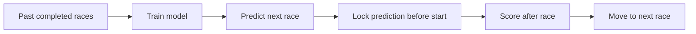

# Motorsport Finishing-Order Prediction

**A machine learning case study in time-aware evaluation**

**Live project demo:** [f1strategydesk.mooo.com](https://f1strategydesk.mooo.com/)

This is a personal, non-commercial learning project driven by an interest in motorsport. It predicts the finishing order of a Grand Prix using information available before the race. The main research challenge is evaluation: a model can look impressive if it accidentally learns from later races or post-race fields. I built a walk-forward evaluation and compared the model with a strong, simple baseline: the starting grid.

> **Portfolio edition.** This repository presents the research question, methodology, aggregate findings, and a small standalone code example. The production system, provider data, telemetry, credentials, and detailed race-level records are held separately. The example does **not** reproduce the reported model results.

## Research question

Can pre-race information improve a full-field finishing-order prediction beyond simply using grid position?

The complete project combines historical results, qualifying/grid data, recent form, practice information, and weather available before the start. It uses a ranking model and a separate retirement component. Predictions are locked before the race, so later outcomes cannot change them.

## Evaluation design

For each target race, the model is trained on races that finished **strictly earlier**. After a race is scored, that race can enter the training set for the next prediction. Model settings were selected with the 2024 and 2025 seasons; 2026 was held out for evaluation. The comparison baseline predicts that each driver finishes in starting-grid order.



I checked temporal leakage by comparing features for the same race when computed with the full dataset and with every later race removed. I also checked that shuffling training labels destroys predictive skill. [Methodology and limitations](docs/METHODOLOGY.md) describes these checks and the metrics.

## Results recorded through 2026 round 13

Spearman's ρ measures agreement between the predicted and actual finishing orders; higher is better. The table reports the project's recorded season summaries, rounded to three decimals.


| Season | Role | Races | Model ρ | Grid baseline ρ | Difference |
|:--|:--|--:|--:|--:|--:|
| 2024 | Model selection | 24 | 0.825 | 0.776 | +0.049 |
| 2025 | Model selection | 24 | 0.764 | 0.736 | +0.029 |
| **2026** | **Held out** | **13** | **0.827** | **0.790** | **+0.037** |

For the 13 held-out races, the recorded model selected the winner in 10 races; the grid baseline did so in 9. It identified an average of 7.69 of the actual top 10 drivers per race, compared with 7.38 for the grid baseline. These figures come from the private evaluation artifacts; this portfolio repository does not contain the underlying race-by-race predictions or third-party datasets.

**Interpretation:** the held-out result is encouraging but limited. Thirteen races are a small sample, and 2024–2025 were used for model selection, so their scores are optimistic estimates of generalization. I do not claim a statistically established advantage or a betting application.

## What I learned

- **The baseline matters.** Grid order is already predictive. Reporting only the model score would hide whether the extra complexity helped.
- **A plausible feature can add no value.** Several practice and weather-derived feature groups showed no meaningful improvement in the recorded ablation study.
- **More recent data is not always better.** Strongly discounting older seasons reduced the effective training sample and hurt performance; milder weighting worked better in the model-selection period.
- **Negative results belong in the report.** Circuit-adaptive blending and a pointwise regressor were tested but did not justify replacing the simpler configuration.

## Selected code example

[`examples/temporal_validation.py`](examples/temporal_validation.py) is a dependency-free illustration of two ideas used in the larger project: strictly prior training rows and rank-based scoring. Its fixtures are invented. Run it with:

```bash
python3 -m unittest discover -s examples -v
```

The full model and provider data are intentionally outside this public-facing case study. The project can be discussed in more detail in an academic review setting.

## Data and attribution

The private system uses software and data services from [Jolpica-F1](https://github.com/jolpica/jolpica-f1), [FastF1](https://docs.fastf1.dev/), [OpenF1](https://openf1.org/), and [Open-Meteo](https://open-meteo.com/). Open-source software licenses do not automatically grant rights to republish upstream race data. This repository republishes none of their raw feeds or telemetry; each provider's terms still apply. This independent project is not official, affiliated with, approved by, or endorsed by the Formula 1 companies or the data providers. F1, FORMULA 1, GRAND PRIX, and related marks belong to their respective owners.
