# Motorsport Finishing-Order Prediction

**A machine learning case study in time-aware evaluation**

**Live project demo:** [Speed Strategy Desk](https://speedstrategydesk.mooo.com/)

[Research findings](#results-recorded-through-2026-round-13) · [Product walkthrough: 20 screenshots](#product-walkthrough-20-screenshots) · [Methodology and limitations](docs/METHODOLOGY.md)

This is a personal, non-commercial learning project driven by an interest in motorsport. It predicts the finishing order of a Grand Prix using information available before the race. The main research challenge is evaluation: a model can look impressive if it accidentally learns from later races or post-race fields. I built a walk-forward evaluation and compared the model with a strong, simple baseline: the starting grid.

**My contribution:** I designed and implemented the data pipeline, ranking approach, chronological evaluation, leakage checks, and web demonstration as an independent project. The providers credited below supply source data and software; they do not sponsor or endorse the work.

> **Portfolio edition.** This repository presents the research question, methodology, aggregate findings, a small standalone code example, and screenshots of the public interface. The production code, machine-readable provider data and telemetry, credentials, and prediction records are held separately. The example does **not** reproduce the reported model results.

## Research question

Can pre-race information improve a full-field finishing-order prediction beyond simply using grid position?

The complete project combines historical results, qualifying/grid data, recent form, practice information, and weather available before the start. It uses a ranking model and a separate retirement component. Prospective predictions are designed to lock before a race; some historical records shown by the demo were generated afterward as walk-forward reconstructions. Their generation timestamps distinguish those cases from original forecasts.

## Evaluation design

For each target race, the model is trained on races that finished **strictly earlier**. After a race is scored, that race can enter the training set for the next prediction. Numerical model settings were selected using the 2024 and 2025 seasons; 2026 is a later evaluation period. Results from 2026 were observed during iterative development, so its final score is **exploratory rather than a fully untouched confirmatory test**. The comparison baseline predicts that each driver finishes in starting-grid order.

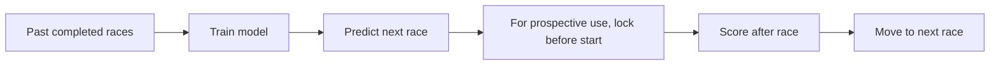
```mermaid
flowchart LR
    A[Past completed races] --> B[Train model]
    B --> C[Predict next race]
    C --> D[For prospective use, lock before start]
    D --> E[Score after race]
    E --> F[Move to next race]
```

I checked temporal leakage by comparing features for the same race when computed with the full dataset and with every later race removed. I also checked that shuffling training labels destroys predictive skill. [Methodology and limitations](docs/METHODOLOGY.md) describes these checks and the metrics.

## Results recorded through 2026 round 13

Spearman's ρ measures agreement between the predicted and actual finishing orders; higher is better. The table reports the project's recorded season summaries, rounded to three decimals.

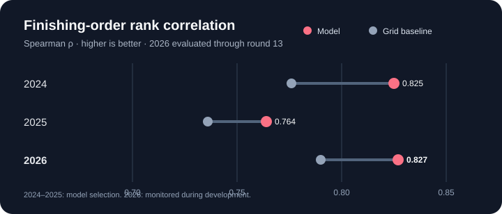

| Season | Role | Races | Model ρ | Grid baseline ρ | Difference |
|:--|:--|--:|--:|--:|--:|
| 2024 | Model selection | 24 | 0.825 | 0.776 | +0.049 |
| 2025 | Model selection | 24 | 0.764 | 0.736 | +0.029 |
| **2026** | **Later evaluation; monitored** | **13** | **0.827** | **0.790** | **+0.037** |

For the 13 evaluated 2026 races, the recorded model selected the winner in 10 races; the grid baseline did so in 9. It identified an average of 7.69 of the actual top 10 drivers per race, compared with 7.38 for the grid baseline. These figures come from the private evaluation artifacts; this portfolio repository does not contain the underlying race-by-race predictions or third-party datasets.

**Interpretation:** the later-period result is encouraging but limited. Thirteen races are a small sample, 2024–2025 were used for model selection, and 2026 was monitored during development. These numbers do not establish a general advantage or support a betting application. A future season evaluated after freezing the complete design would provide stronger evidence.

## What I learned

- **The baseline matters.** Grid order is already predictive. Reporting only the model score would hide whether the extra complexity helped.
- **A plausible feature can add no value.** Several practice and weather-derived feature groups showed no meaningful improvement in the recorded ablation study.
- **More recent data is not always better.** Strongly discounting older seasons reduced the effective training sample and hurt performance; milder weighting worked better in the model-selection period.
- **Negative results belong in the report.** Circuit-adaptive blending and a pointwise regressor were tested but did not justify replacing the simpler configuration.

## Selected code example

[`examples/temporal_validation.py`](examples/temporal_validation.py) is a dependency-free illustration of two ideas used in the larger project: strictly prior training rows and rank-based scoring. Its fixtures are invented. Run it with:

```bash
python3 -m unittest discover -s examples -v
```

The full model and provider data are intentionally outside this public-facing case study. The project can be discussed in more detail in an academic review setting.

### What can be checked here

The included tests check the temporal cutoff and rank-scoring example on invented rows. The summary chart and table can be compared with each other, but the underlying model results **cannot be independently recomputed** from this repository. This is a transparent research case study, not a reproducibility package for the production model.

## Product walkthrough: 20 screenshots

These screenshots were captured on **20 September 2026**. They document the interface at that moment; standings, schedules, and season metrics on the live site can change. The research table above stops at round 13, while several screenshots show the site's later round-14 snapshot. The images include rendered third-party race data, so attribution and usage terms are listed below. Expand an item to view its image and explanation.

**How to read the sources:** [Jolpica-F1](https://github.com/jolpica/jolpica-f1) supplies historical race results, qualifying, schedules, and standings; [FastF1](https://docs.fastf1.dev/) supplies historical lap and car telemetry used in the comparisons; [OpenF1](https://openf1.org/) supplies historical position, stint, pit-stop, and race-control views; [Open-Meteo](https://open-meteo.com/) supplies weather. The ranking, probabilities, evaluation scores, estimated overtaking labels, and simplified pit-window calculation are project outputs, not official measurements. Source availability varies by screen and race.

<details>
<summary>1. Season overview — headline metrics and navigation</summary>

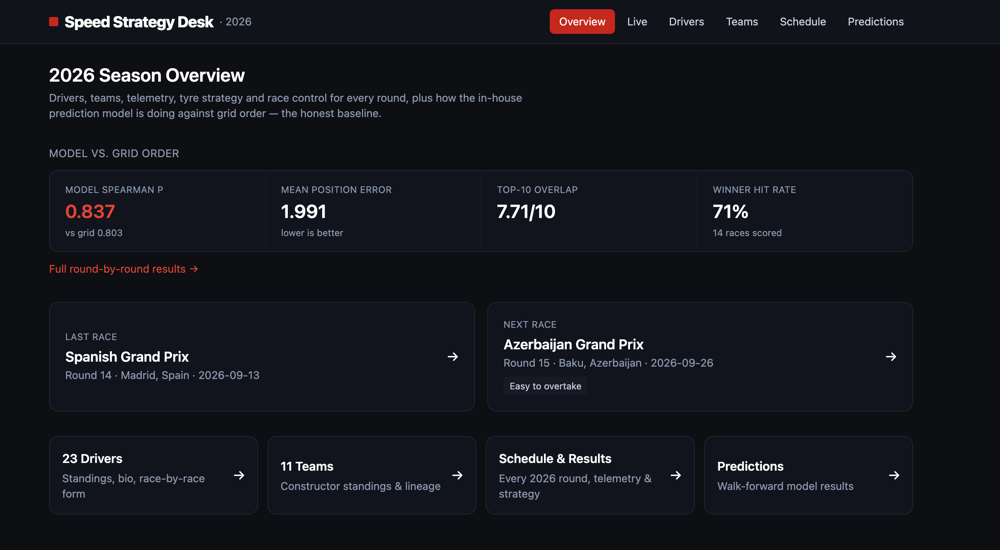

**What it shows:** The home page links to the main sections and summarizes the latest completed rounds. Spearman ρ measures agreement between predicted and actual finishing order (closer to 1 is better); the grid-order baseline is the comparison. Mean position error is the average absolute finishing-place error (lower is better), Top-10 overlap is the average number of actual top-ten drivers found in the predicted top ten, and winner hit rate is the share of scored races whose winner was ranked first. The pictured 14-race values are a later snapshot than the 13-race research table above.

</details>

<details>
<summary>2. Live page — session clock and data availability</summary>

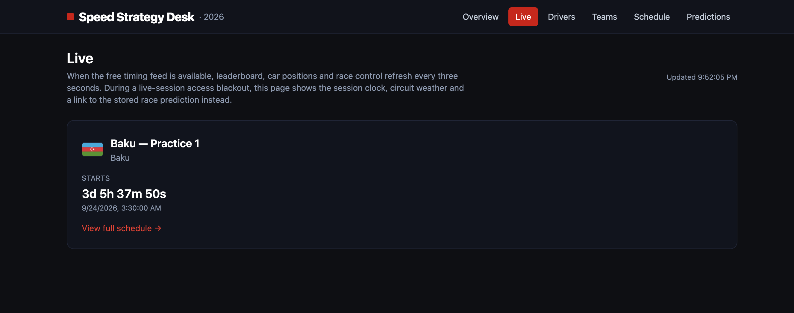

**What it shows:** Before a session, the page displays the next event and a countdown. Historical timing and live-session access have different availability; when a free live timing feed is unavailable, the page falls back to the session clock, available circuit weather, and a link to a stored prediction. A countdown is not evidence of live car positions.

</details>

<details>
<summary>3. Drivers — championship standings</summary>

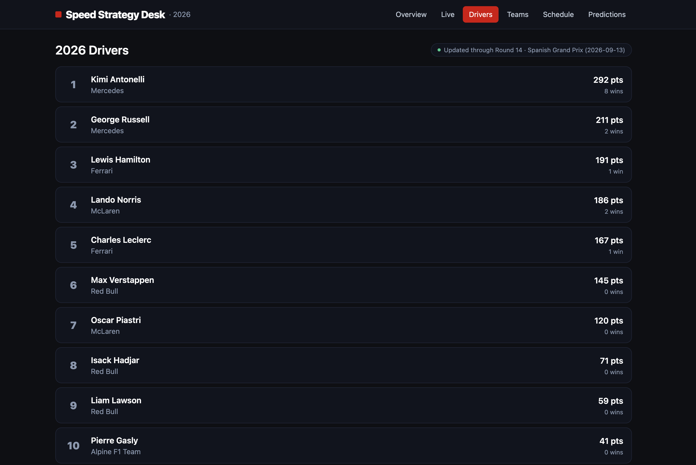

**What it shows:** The standings list rank, driver, team, championship points, and wins through the round named in the update badge. These are observed season results from the race-data provider, not predictions. Selecting a driver opens the race-by-race view in screenshot 8.

</details>

<details>
<summary>4. Teams — constructor standings</summary>

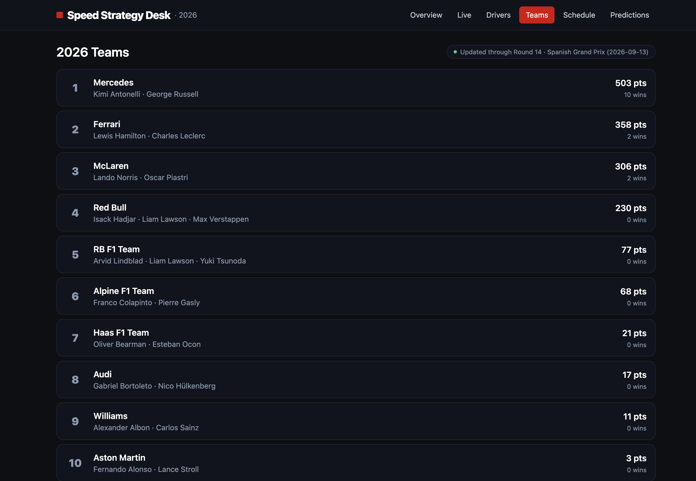

**What it shows:** Constructor standings report each team's points and wins as of the update badge. Driver names below a team describe its season roster and can include replacements; the current roster display should not be used to recompute the team's published points. Screenshot 9 opens one team's round-level results.

</details>

<details>
<summary>5. Schedule — races and circuit context</summary>

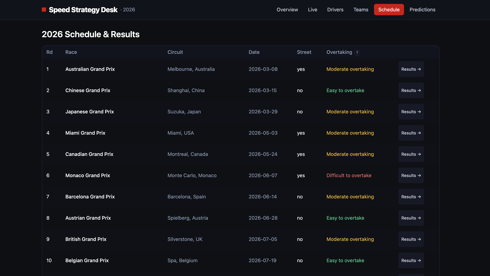

**What it shows:** The table gives round, race, circuit, date, street-circuit flag, and a route to completed results. Its overtaking category is a hand-set project estimate for strategy context, not an official or live measure of passing difficulty.

</details>

<details>
<summary>6. Predictions — season metrics and accuracy trend</summary>

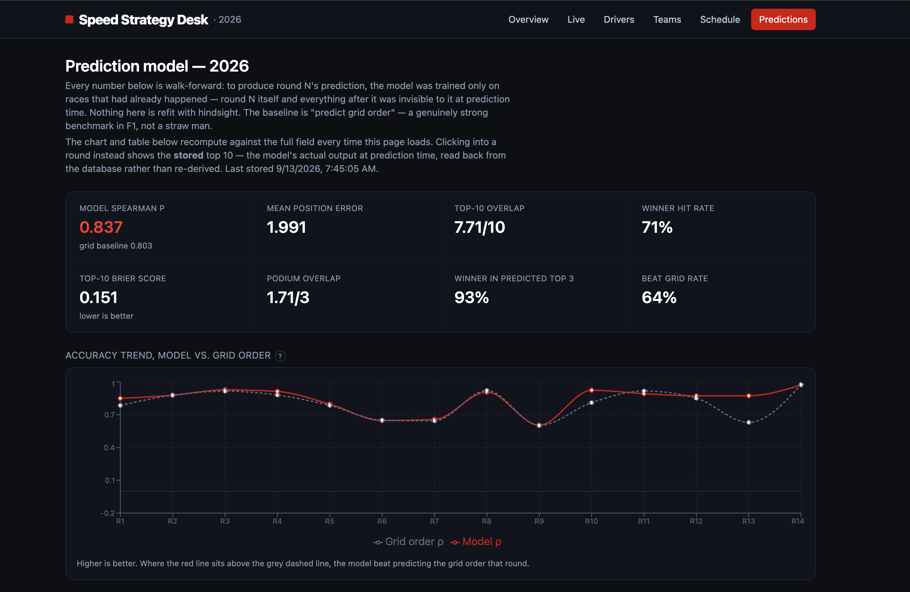

**What it shows:** The red line is the model's per-round Spearman ρ and the dashed grey line is the grid-order baseline. The cards also show mean position error, Top-10 and podium overlap, winner hit rate, winner in the predicted top three, and the fraction of rounds that beat grid order. Top-10 Brier score measures squared error in the model's Top-10 probabilities (lower is better). These are retrospective evaluation summaries; generation timestamps on individual records determine whether a stored output was originally made before its race.

</details>

<details>
<summary>7. Predictions — round-by-round comparison</summary>

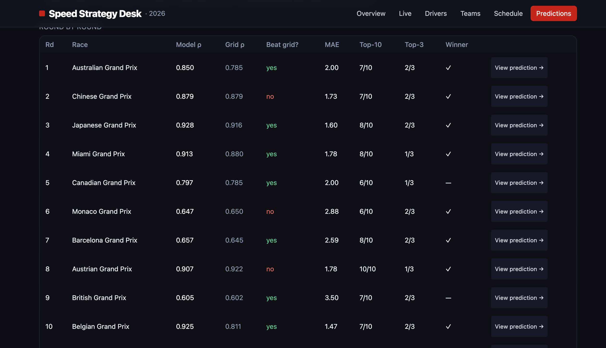

**What it shows:** Each row compares model and grid ρ for one race, followed by mean absolute position error, Top-10 and podium overlap, and whether the predicted first-place driver won. “Beat grid?” is yes only when model ρ exceeds grid ρ; a tie appears as no. The detailed record for a round is opened with “View prediction.”

</details>

<details>
<summary>8. Driver detail — qualifying, grid, finish, and status</summary>

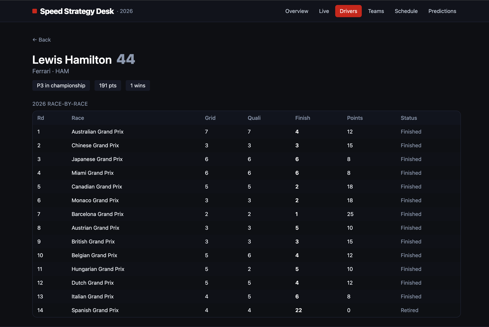

**What it shows:** The driver page separates qualifying position from starting-grid position, which can differ after penalties or other changes. Finish, points, and status describe the observed race outcome; a retirement and a low classification are not interchangeable with a slow lap-time estimate.

</details>

<details>
<summary>9. Team detail — member results by round</summary>

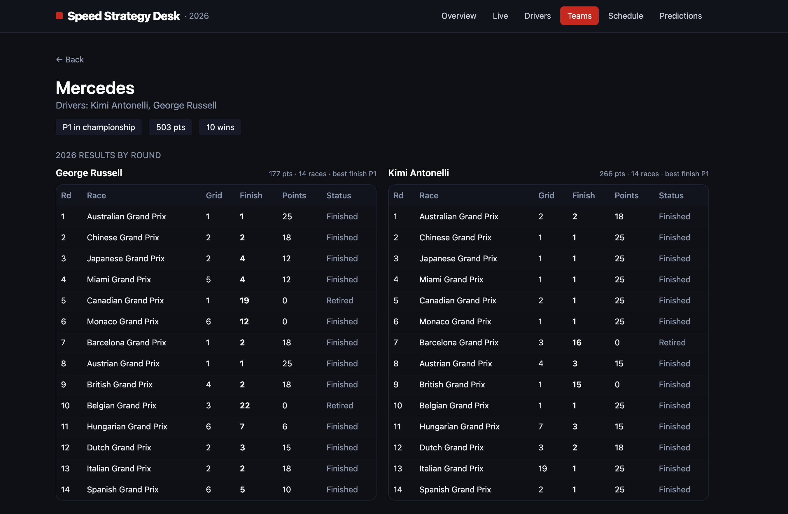

**What it shows:** The top badges summarize the team's championship position, points, and wins. The two tables provide each displayed driver's grid, finish, points, and status by race. These tables are a view of selected driver results, not a full accounting of every way constructor points may have been earned.

</details>

<details>
<summary>10. Race detail — circuit, result, and qualifying</summary>

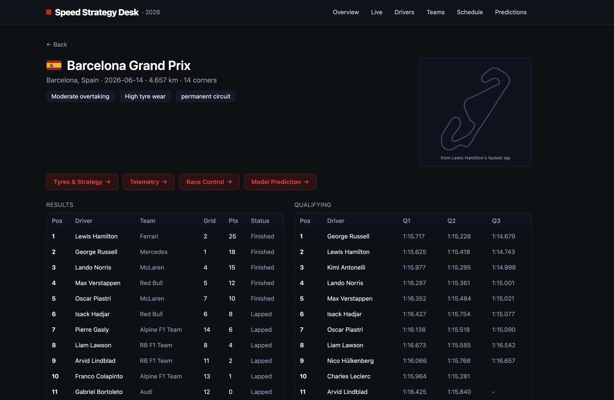

**What it shows:** A completed race page combines circuit metadata, a track outline traced from a historical lap, finishing results, and Q1/Q2/Q3 qualifying times when available. “Grid” is the start position, while qualifying columns are session times; the outline is an analytical visualization, not an official circuit graphic.

</details>

<details>
<summary>11. Tyre strategy — observed stint plan</summary>

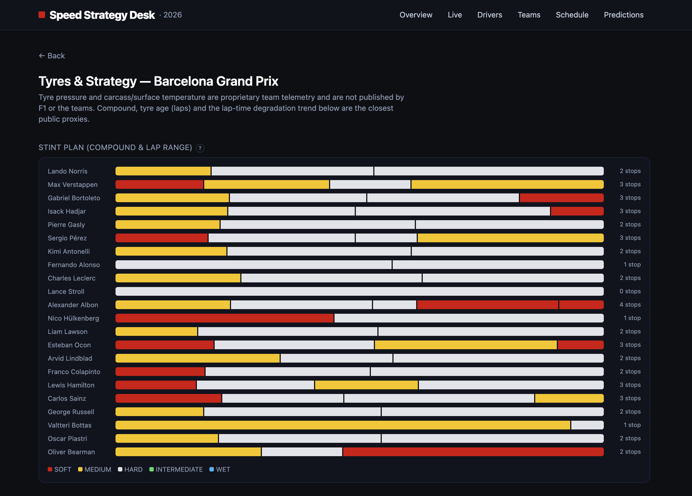

**What it shows:** Each horizontal segment covers the laps of one historical tyre stint. Red, yellow, white, green, and blue indicate soft, medium, hard, intermediate, and wet compounds; vertical boundaries indicate changes between stints, and the right edge gives stop count. This is a description of what happened, not a recommended future strategy.

</details>

<details>
<summary>12. Positions, pit stops, and safety-car history</summary>

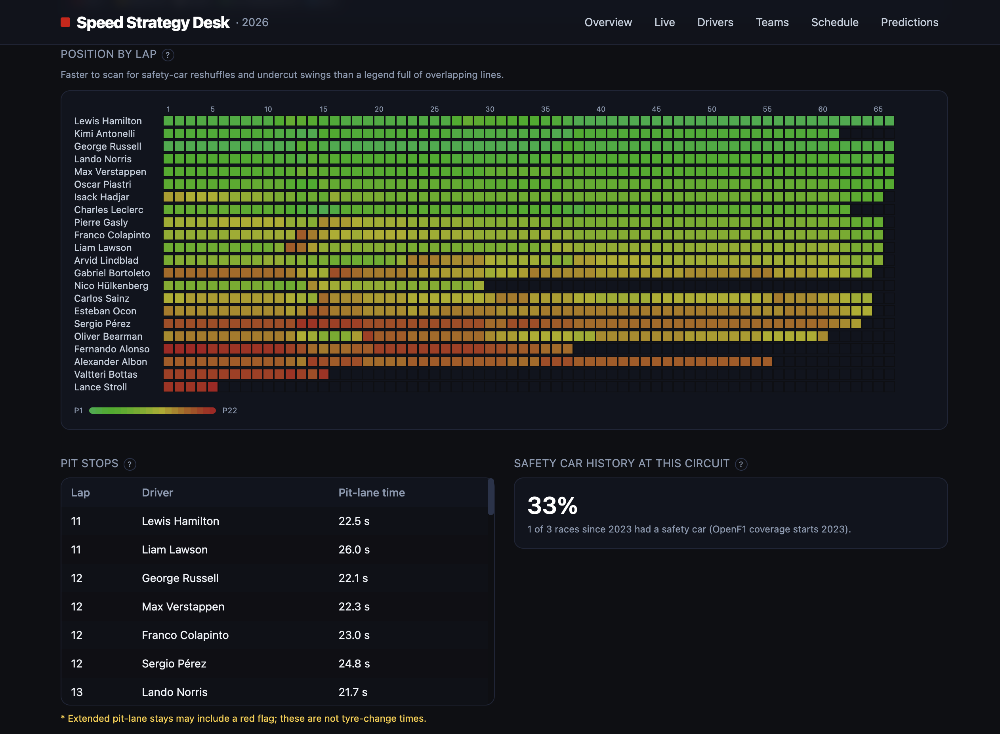

**What it shows:** Each heatmap cell is a driver's position at a lap, with green nearer P1 and red toward the back; dark cells mark unavailable later positions. Pit-lane time is the elapsed lane visit, not solely the stationary tyre-change time. The safety-car percentage is based on the small number of historical races covered by the cited provider at that circuit, so “1 of 3” should not be read as a precise future probability.

</details>

<details>
<summary>13. Degradation estimates and a simplified pit-window simulator</summary>

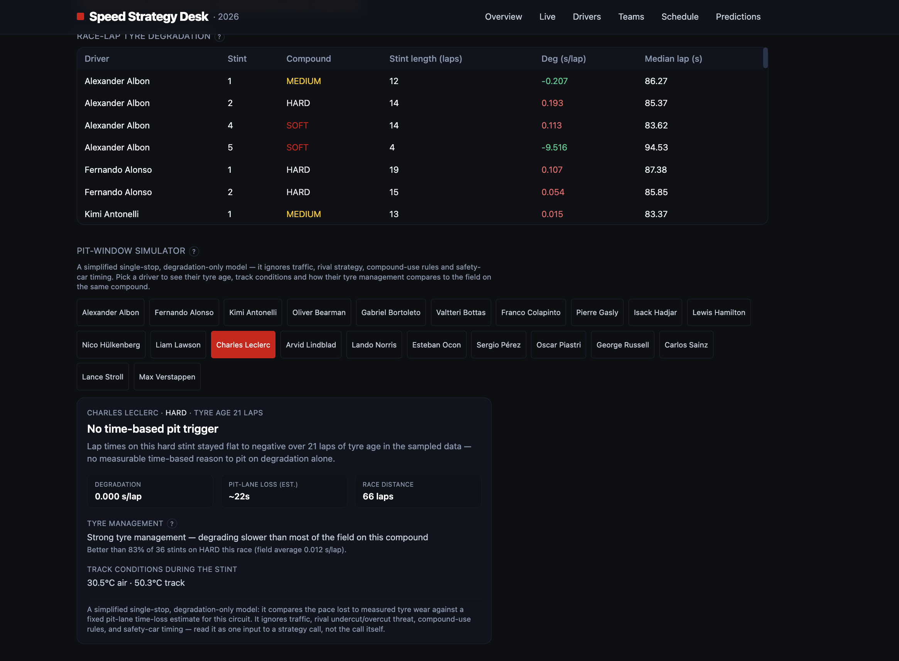

**What it shows:** “Deg (s/lap)” is a fitted change in lap time within an observed stint; negative values can reflect fuel burn, track evolution, sparse samples, or unusual laps, so they are not a direct measurement of tyre health. The simulator compares an estimated degradation cost with a pit-lane-loss estimate for a single stop. It deliberately omits traffic, rival strategy, compound rules, and safety-car timing; “no time-based pit trigger” is a narrow model result, not race advice.

</details>

<details>
<summary>14. Gap chart — time to race leader</summary>

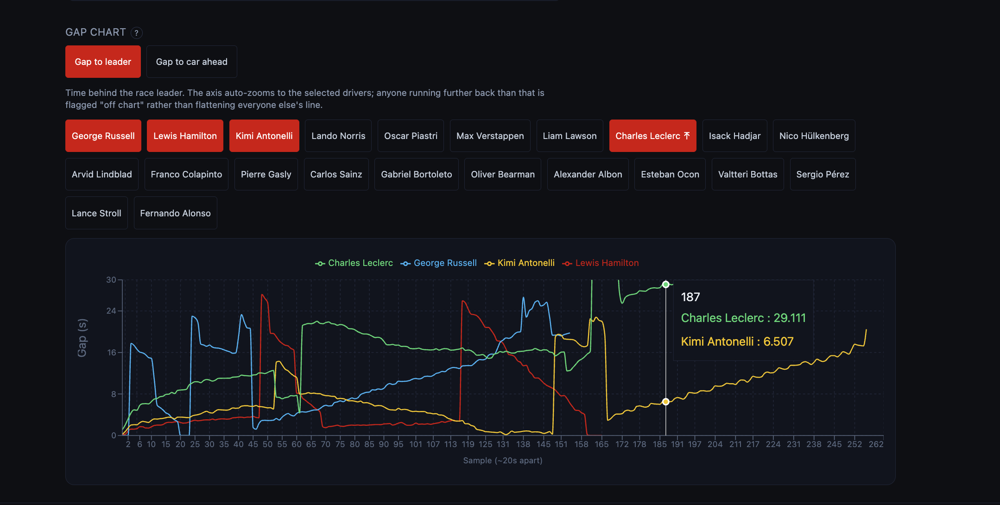

**What it shows:** Historical interval samples plot seconds behind the leader across the race for the selected drivers. The horizontal axis indexes samples roughly 20 seconds apart; the vertical axis is seconds, with smaller gaps nearer the leader. The display auto-zooms, so an “off chart” trace is outside the shown range rather than exactly flat or zero.

</details>

<details>
<summary>15. Gap chart — time to the car ahead</summary>

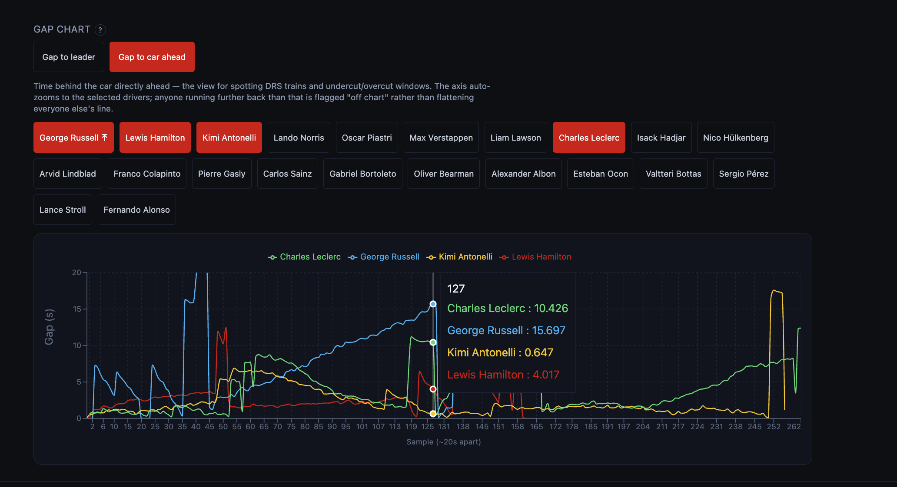

**What it shows:** This mode changes the reference from the leader to the car immediately ahead at each sample. It can help inspect intervals relevant to overtakes and pit decisions, but it does not itself prove a DRS activation or a successful undercut. Hover values are sampled historical data, not a continuously measured forecast.

</details>

<details>
<summary>16. Telemetry — compare two historical laps</summary>

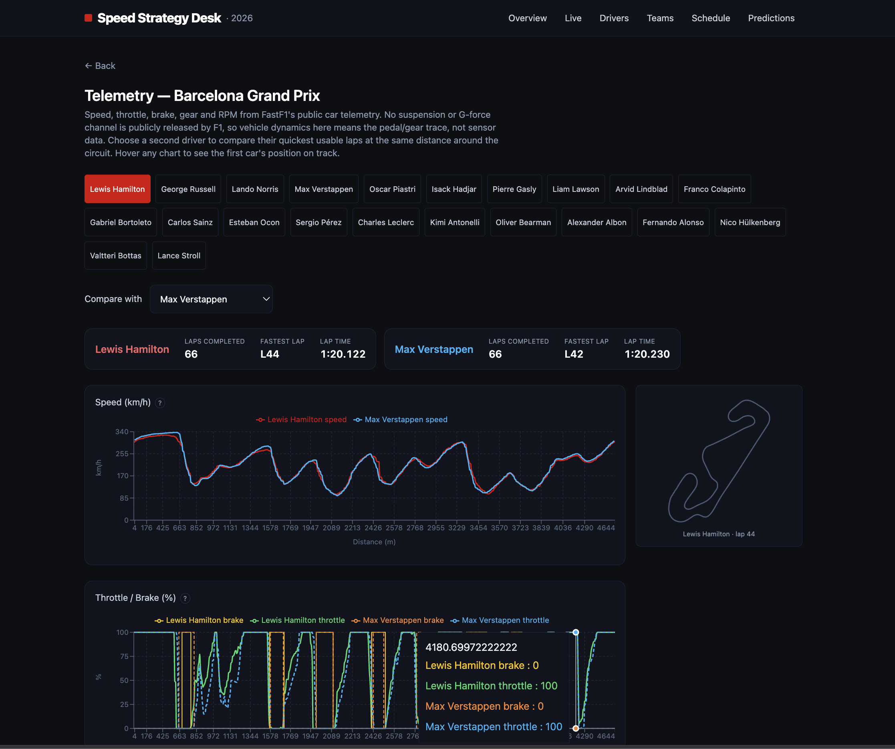

**What it shows:** The page aligns each selected driver's quickest usable lap by distance around the circuit. Speed is in km/h; throttle and brake are percentages; further plots show gear, RPM, and lap-time delta. These are historical car-telemetry channels supplied through FastF1, not tyre pressure, suspension, or G-force measurements.

</details>

<details>
<summary>17. Telemetry hover — locating one sample</summary>

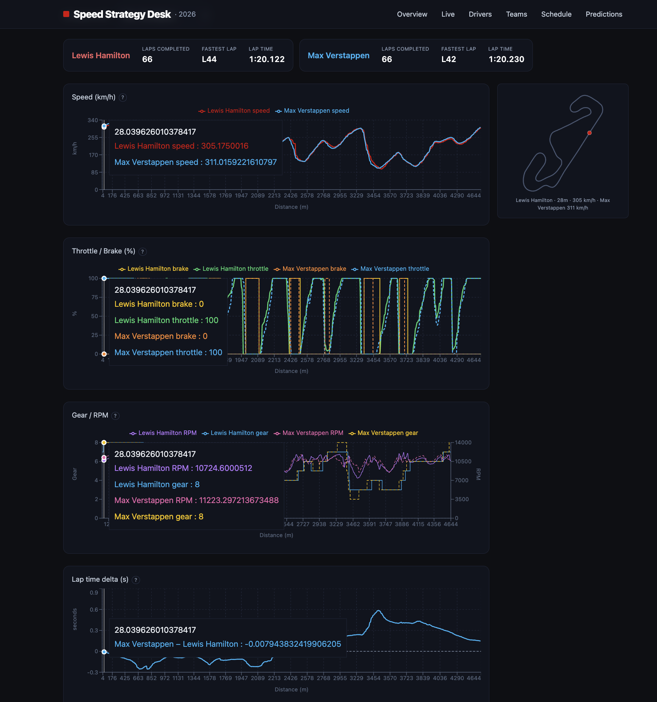

**What it shows:** Hovering a distance sample reveals each driver's values at that location and marks the point on the circuit outline. The tooltip in this capture displays more decimal places than the underlying measurement warrants; interpret the traces and units rather than treating those digits as extra physical precision.

</details>

<details>
<summary>18. Telemetry traces — pedals, drivetrain, and lap delta</summary>

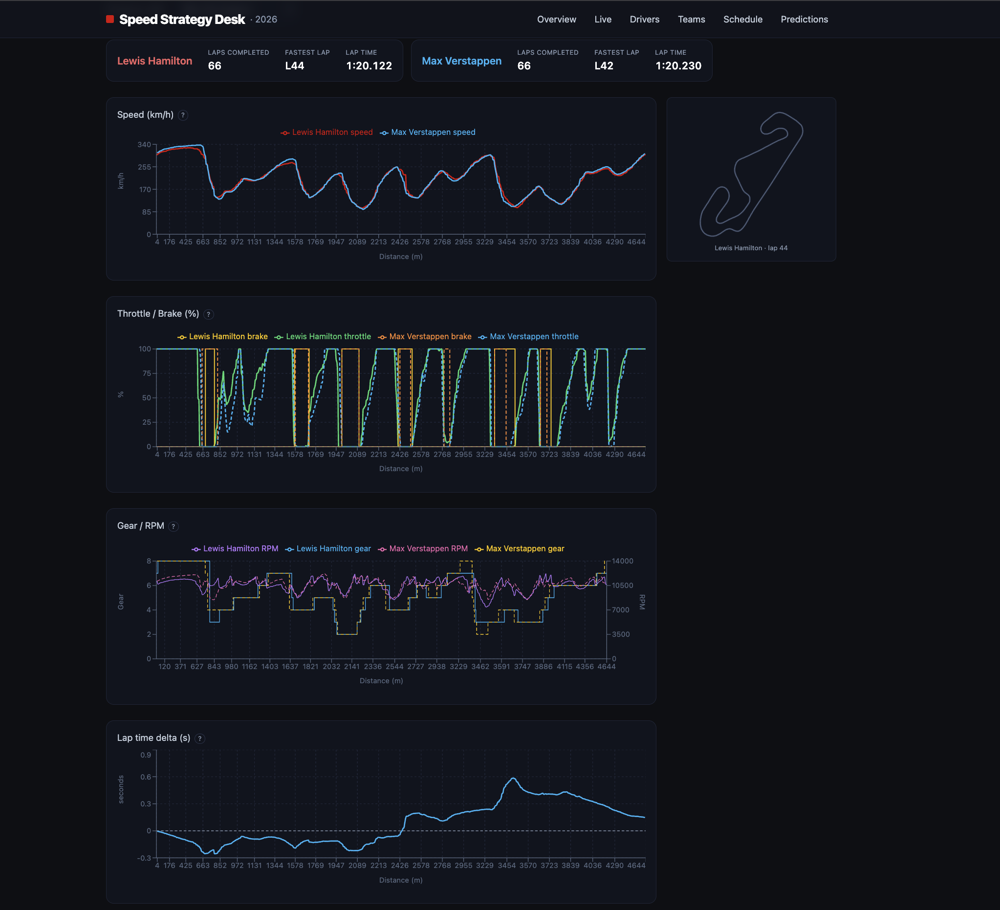

**What it shows:** Stacked plots compare speed, braking/throttle application, gear and engine RPM along the same lap distance. The lap-time-delta curve accumulates time difference between the two selected laps and can change sign as one driver gains time in a sector. This is a comparison of selected historical laps, not a whole-race pace prediction.

</details>

<details>
<summary>19. Race control — historical message filters</summary>

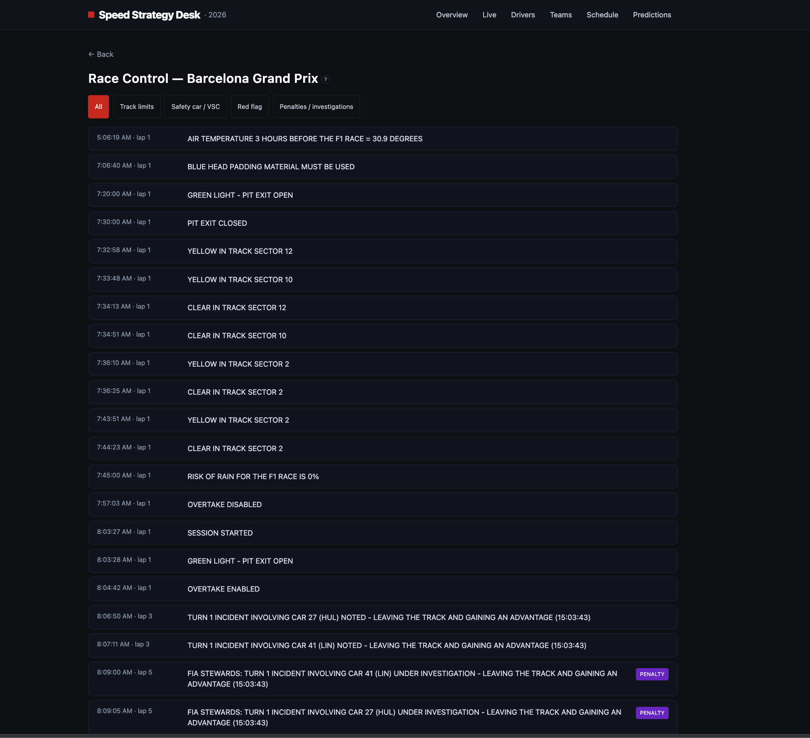

**What it shows:** The interface groups historical race-control messages by track limits, safety car or virtual safety car, red flags, and penalties or investigations. Times and lap labels identify when a message was recorded. The displayed text is sourced from the historical data provider; this independent interface is not an official race-control channel.

</details>

<details>
<summary>20. One stored prediction — result comparison and provenance warning</summary>

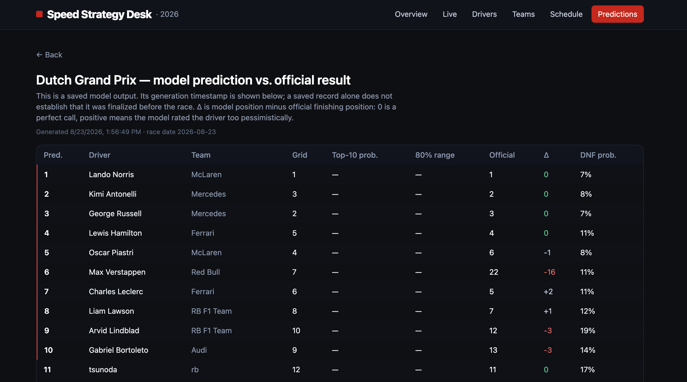

**What it shows:** “Pred.” is the model rank, “Official” is the observed finish, and Δ is model rank minus official position; positive values mean the model placed the driver too low. DNF probability is an estimated retirement risk; dashes in probability and interval columns mean no value was available. Crucially, this capture says **generated 10 August for a 14 June race** and shows only **20 of 22** expected entries. It is a retrospective, incomplete historical record, **not proof of a pre-race forecast**. The older page wording visible in this screenshot incorrectly called every saved record pre-race; that wording has since been corrected on the live site.

</details>

## Data and attribution

The private system uses software and data services from [Jolpica-F1](https://github.com/jolpica/jolpica-f1), [FastF1](https://docs.fastf1.dev/), [OpenF1](https://openf1.org/), and [Open-Meteo](https://open-meteo.com/). The screenshots above show rendered examples of third-party-sourced race information; this repository contains no machine-readable provider feeds, source telemetry files, credentials, or production database. [Jolpica-F1's data terms](https://github.com/jolpica/jolpica-f1/blob/main/TERMS.md) and [Open-Meteo's terms](https://open-meteo.com/en/terms) apply to their respective data. Open-source software licenses do not automatically grant rights to republish upstream content. This independent project is not official, affiliated with, approved by, or endorsed by the Formula 1 companies or the data providers. F1, FORMULA 1, GRAND PRIX, and related marks belong to their respective owners.
